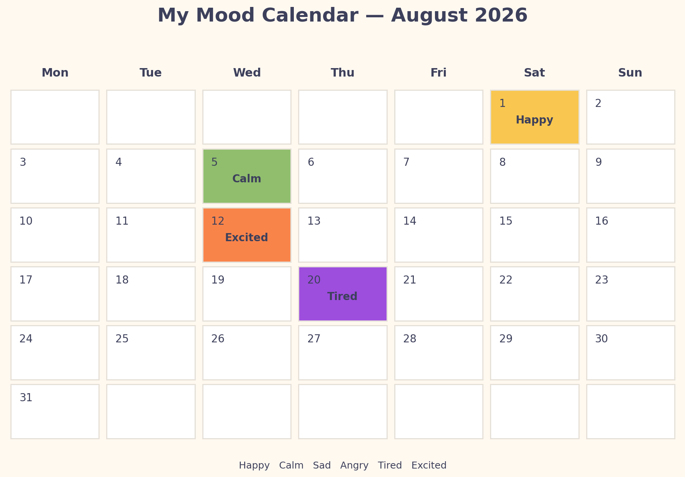

# Mood Tracker

A simple Python application for recording your daily mood and turning it into a colorful monthly calendar.



## Features

- Save or update a mood for any date
- Choose from six moods: Happy, Calm, Sad, Angry, Tired, and Excited
- Generate a clean monthly calendar using Matplotlib
- Keep mood entries in a local CSV file

## Getting Started

Install the required package:

```bash
python -m pip install -r requirements.txt
```

Run the application:

```bash
python mood_tracker.py
```

Choose **1** to record a mood, then choose **2** to create and view the calendar.

## Files

| File | Purpose |
| --- | --- |
| `mood_tracker.py` | Main application code |
| `moods.csv` | Saved mood entries |
| `mood_calendar.png` | Generated monthly calendar |

## Built With

Python and Matplotlib.
